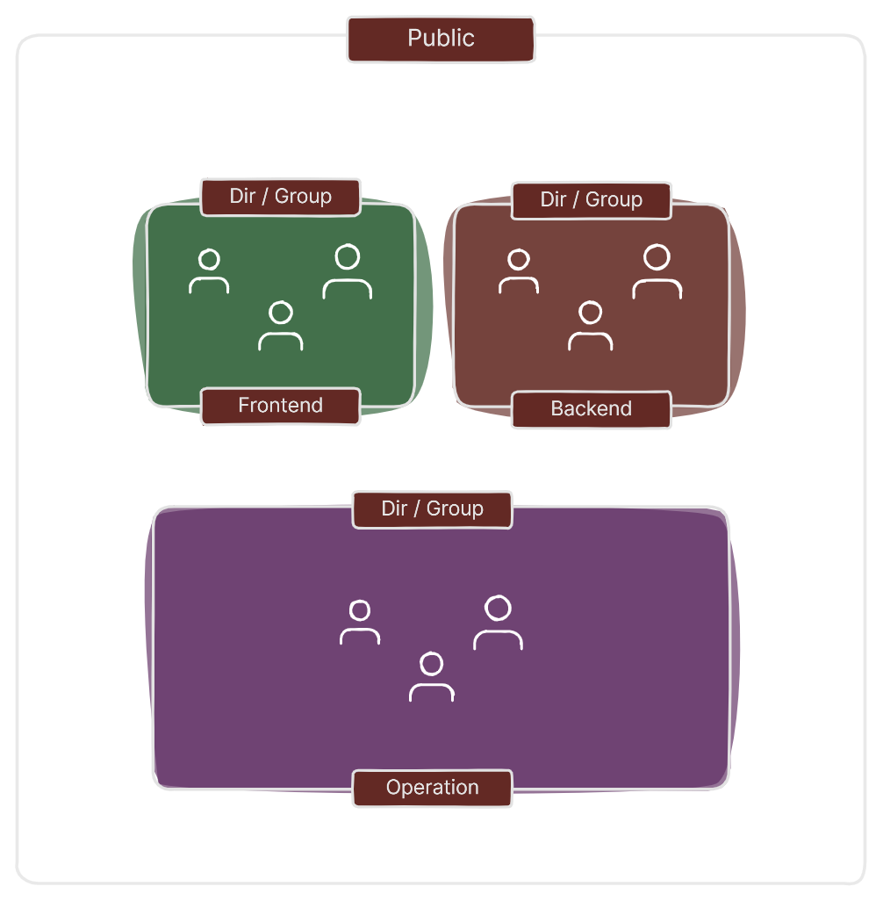

# Automating the creation of users, permissions, directories, and groups with Bash

The main goal of DevOps is to `ship code faster` and efficiently.

However for that to happen first A SaaS company would likely need to create groups, directories, and users for new employees.

A SAAS company might do this with Linux in a scenario where they are using a `self-hosted deployment` model.

SaaS companies typically offer their software as a service, meaning it's hosted on the company's infrastructure and accessed by users through a web interface.

However, some companies might choose a `self-hosted` model where they install and manage the SaaS application on their own Linux servers.

In this self-hosted scenario, the company would need to create user accounts on the `Linux server` for each new employee. These accounts would grant them access to the specific resources and applications they need to do their jobs.



## Methodology

The script below illustrates a possible solution for manage users in a Linux server with a bash.

## Table of Contents

1. Payroll Table
2. Script
3. Permissions Strings
4. Conclusion
  
## Payroll Table

Below is the payroll table that will be used to create the user management script.

| Employees | Directory         | Group       | Permission                    |
|-----------|-------------------|-------------|-------------------------------|
|Noah       | frontend/public | frontend      | rwx (read,write,execute)      |
|Amelia     | frontend/public | frontend      | rwx                           |
|Bryan      | frontend/public | frontend      | rwx                           |
|Jane       | backend /public | backend       | rwx                           |
|Devin      | backend /public | backend       | rwx                           |
|Bryan      | backend /public | backend       | rwx                           |
|Noah       | ops     /public | ops           | rwx                           |
|Noah       | ops     /public | ops           | rwx                           |
|Noah       | ops     /public | ops           | rwx                           |

### Script

The script below creates the above infrastructure

```ruby

#!/bin/bash

# Creating directories
sudo mkdir /public  # sudo execute the command with superuser privileges
sudo mkdir /frontend     # mkdir is the command for creating a directory
sudo mkdir /backend
sudo mkdir /ops

# Creating groups
sudo groupadd GRP_FRONTEND  # groupadd creates a new group
sudo groupadd GRP_BACKEND
sudo groupadd GRP_OPS

# Creating users for the ADM group
sudo useradd Jane -m -s /bin/bash -G GRP_FRONTEND     # -m: This option tells useradd to create a home directory for the new user. The home directory will be created with the same name as the username.
sudo useradd Devin  -m -s /bin/bash -G GRP_FRONTEND   # -s /bin/bash: specifies the default shell for the new user 
sudo useradd Bryan   -m -s /bin/bash -G GRP_FRONTEND  #  -G: This option adds the new user to a group

# Creating users for the SELLS group
sudo useradd Sarah -m -s /bin/bash -G GRP_BACKEND
sudo useradd Elijah -m -s /bin/bash -G GRP_BACKEND
sudo useradd Maya -m -s /bin/bash -G GRP_BACKEND

# Creating users for the OPS group 
sudo useradd Noah -m -s /bin/bash -G GRP_OPS
sudo useradd Amelia  -m -s /bin/bash -G GRP_OPS
sudo useradd Bryan -m -s /bin/bash -G GRP_OPS

# Specifying permissions for directories
sudo chown root:GRP_FRONTEND /frontend    # chown(change owner) adds the root user as owner of the ADM group 
sudo chown root:GRP_BACKEND /backend
sudo chown root:GRP_OPS /ops

#  Managing permissions
sudo chmod 770 /frontend   # chmod modify the permissions assigned to files and directories in the system.
sudo chmod 770 /backend # 770 is the permission string*  
sudo chmod 770 /ops
sudo chmod 777 /public

```

### Permissions Strings

The permissions string defines a `specific access` level for the owner, the group, and others on a file or directory.

- 4 represents read only (r = 4 in binary)
- 5 represents read and execute (r = 4, x = 1)
- 7 represents all permissions (read, write, and execute)

**Here's an example to illustrate:**

Consider a permission string -rwxr--r--.

The first character - indicates it's a regular file.
Owner (first set of three): "rwx" - This translates to read, write, and execute permissions for the owner (user who owns the file).
Group (second set of three): "r--" - This translates to read permission only for the group.
Others (third set of three): "r--" - This translates to read permission only for others (users who are not the owner and not in the group).

## Conclusion

It's important to note that this scenario is `less common` for modern SaaS companies. Most SaaS companies would leverage a `cloud-based deployment` model where user management and access control are handled by the provider, eliminating the need for direct Linux administration.

There might be some `hybrid deployments` where core functionalities are self-hosted on Linux servers while other aspects leverage cloud services. In such cases, user and group management on the Linux side might still be necessary.
