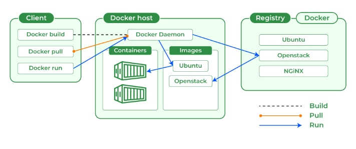
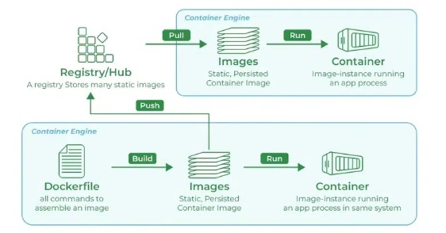
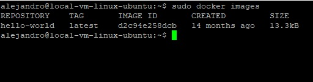
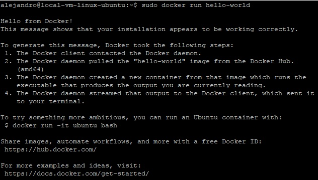
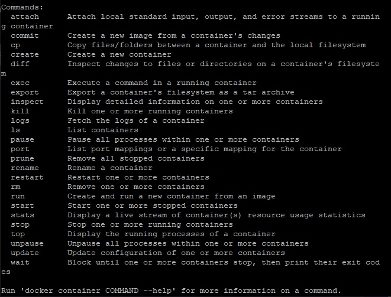

# Containerizing With Docker Engine

Docker containers are `self-contained` units that include everything an application needs to run, from its code to its `libraries` and dependencies.

Simply put, it solves the *"It worked on my machine"* problem.

# Docker Concepts



| Name          | Description                           |
|---------------|---------------------------------------|
| Container     | A box filled with dependencies        |
| Client        | Where we run docker commands          |
| Host          | Where containers live                 |
| Daemon        | Who manages docker operations         |
| Registry      | Where images live                     |
| Images        | A container blueprint                 |
| Dockerfile    | Who creates images                    |
| Objects       | Instances of things like images       |
| Storage       | A place to keep files                 |



# Docker Engine vs Docker Desktop

Docker Engine is a lower-level tool, geared towards system administrators. On the other hand, Docker Desktop provides developers with a user-friendly interface and additional tools.

# Installing Docker Engine

The easiest way to install Docker is with a convenience script they provide.

```ruby
curl -fsSL https://get.docker.com -o get-docker.sh
sudo sh get-docker. sh
```

# Pulling a Docker Image

Pulling an image from a public repository like Docker Hub allows you to quickly deploy a pre-built application without manually installing all the dependencies. Let's draw the `hello-world` image.

```ruby
sudo docker pull hello-world
```

# Checking the images

```ruby
sudo docker images

```


# Running the image

```ruby
sudo docker run hello-world
```


# Running an Interactive Image in the Background

In most cases, you'll likely use the `-d` or `-its flags along with the `run` command.

1. Use `-d` for background processes or services.
2. Use `-it` to start a container in the foreground and interact with it like a regular terminal session.

# Docker --Help
Use `sudo docker --help` to see all commands and `sudo docker <command> --help` to see all available flags(options) for the command. 



# Usefull Docker Commands

| Name                                                 | Description                              |
|------------------------------------------------------|------------------------------------------|
| docker rm `id`                                       | Removes containers                       |
| docker rmi `name`                                    | Removes images                           |
| docker ps                                            | List containers                          |
| docker stop `id`                                     | Stop a running container                 |
| docker run `-dti --name container image`             | Name a container                         |
| docker exec `-ti Ubuntu /bin/bash`                   | Executes bash inside Ubuntu              |
| docker exec `Ubuntu mkdir /destiny`                  | Creates a `destiny` inside the container |
| docker `cp file container:/destiny`                  | Copy to container from local machine     | 
| docker `cp container:/originfolder/file new-filename`| Copy to local machine from container     | 
| docker pull debian:9                                 | Pulls specific Debian container version  | 

# Installing a MYSQL container

Running a MYSQL database in a container prevents conflicts with other software or system-wide configurations.

```ruby
docker pull MySQL
```

# Running a MySQL container

```ruby
docker run -e MYSQL_ROOT_PASWORD=password --container name -d -p 3306:3306 image-name
```
1. `-e` Sets environmental variables.
2. `-d` Executes the database in the background.
3. `-p` Opens a port to communicate with the database. 


# Accesing MYSQL to create a Database

Executing bash inside the MySQL container to manage the database.

```ruby
docker exec -it container-name bash 
```

# MYSQL client

Another way to interact with the database is through the Mysql client.

```ruby
apt -y install mysql-client
```

# Login to MYSQL to create a new database

After accessing bash we must login into MySQL to be able to manage our databases via SQL. After inserting the command below we will be prompted to insert the `root` user password. 

```ruby
MySQL -u root -p --protocol=tcp
```

# Troubleshooting connection issues

Docker assigns an IP to every container to be able to connect with other distributed systems independently. To troubleshoot any connection issues we must use the `inspect` command.

```ruby
docker inspect container-name
```

# Data storage in containers

Containers are ephemeral, meaning their data is lost when the container stops. Mounts allow you to persist data beyond the container's lifecycle. A mount is a way to share data or files between the host system and the container. It essentially creates a link between a directory or file on the host machine and a directory within the container.

```ruby
docker run -e MYSQL_PASSWORD=your-password --name container-name -d -p 3306:3306 --volume=/host-path -A:/container-path image-name
```
# Mount Types

1. Bind: Binds a directory from the container to a directory in the host (example above)

```ruby
docker run -v /hostdir:/containerdir image-name
``` 
2. Named: Manually created volumes inside a standard directory.

```ruby
docker volume create volume-name # Creates volumes
docker run -v volume-name:/container-directory image name # Refeerences the created volume
```

# Pulling an Apache Container

Apache, also called `Apache HTTP Server`, is free and open-source software that powers many websites. When you type a web address into your browser, Apache receives the request and fetches the relevant files (like HTML, CSS, and images) that make up the webpage.

It then sends this information back to your browser, which interprets it and displays the webpage. 

```ruby
docker pull httpd # Pulls the official Apache container from the docker hub
```

# Interesting Fact 

Apache is a core component of the `LAMP` stack, a popular combination of open-source software for building websites. `LAMP` stands for Linux (operating system), Apache (webserver), MySQL (database), and PHP (programming language).


# Bindind a local volume to an Apache Web Server Container

By binding a local folder on your machine (where you're developing your website) to the `Apache` container's document root (the folder where it looks for website files), you can make changes to your code and see them reflected immediately in your web browser without needing to rebuild the `container image` or copy files back and forth. This allows for a much faster development workflow.

```ruby
docker run --name container-name -d -p 80:80 --volume=host-volume-path -A:/usr/local/apache2/htdocs httpd
```
1. host-volume-path: Where the website files are
2. -d: Runs the container in the background
3. /usr/local/apache2/htdocs: The standard directory for file storage in the Apache container.
4. httpd: The image name

# CPU and Memory Optimization

Resource optimization is important for containerized apps since an over-expanding container could hinder the performance of the whole system.

```ruby
docker update container-name -m 128M --cpus 0.2
docker stats container-name # Provide container stats

```
1. -m 128M: Limit the memory to 128mb
2. --cpus 0.2: Limit the cpu usage to 20%

# Stress Testing 

Stress testing helps us understand how a containerized application behaves under heavy load. This can reveal bottlenecks in CPU, memory, or disk usage. The command `stress` is a `stress test generator` that simulates heavy workloads to see how your system responds.

```ruby
apt install -y stress
stress --cpu 1 --vm-bytes 50m --vm 1 --vm-bytes 50m  
```
1. --cpu 1: Cpus to stress
2. --vm-bytes: Bytes volume to stress
3. --vm 1: Memory stress

# Docker Info, Logs, Top
Here are some useful docker commands for managing containers.

```ruby
docker info # Shows server info
docker logs container-name # Shows container logs
docker top container name # Shows container processes
```
# Networking

In containerized environments, like Docker, `multiple containers` are often used to build applications. Each container typically runs a single service, but these services often need to communicate with each other to function properly. This is where container networking comes in.

```ruby
docker network -ls # List networks
docker inspect network-name # List containers within the network
docker network create new-network # Create a new network
```
Container isolation: Network isolation allows you to define which containers can communicate, and how. For example; a container running a database might not need access to the internet. Also, if a container gets compromised by malware, network isolation can limit the attacker's ability to spread to other containers on the system.  

```ruby
docker run -dti -name container-name --network network-name image-name # Creates a container inside a defined network
```

# Dockerfile

A Dockerfile is a text document that contains instructions for building a `Docker image`. It essentially acts like a recipe that Docker follows to create a `customized environment` for your application to run in. 

Common instructions involve:
1. FROM: Specifying the base `image` to start from (like Ubuntu or a pre-built image).
2. COPY: Copying files from your `local machine` into the image.
3. RUN: Executing commands within the image to install dependencies, configure the `environment`, etc.
4. EXPOSE: Defining ports that the application running in the container will listen on.
5. CMD or ENTRYPOINT: Specifying the command to run when the `container starts` (like launching your application).

1. Creating a Dockerfile
```bash
nano dockerfile # Creates a dockerfle
```
2. Editing a Dockerfile example that creates an Ubuntu and Python image.

```yml
FROM ubuntu
RUN apt update && apt install -y python3 && apt clean
COPY app.py /apt/app.py
CMD phyton3 apt/app.py
```

3. Building a Dockerfile

The basic syntax for docker build is:
```bash
docker build [OPTIONS] <context>
# Example
docker build. -t ubuntu-python
```

1. `<context>` is typically the path to the directory containing your `Dockerfile`. By default, the current directory is used if not specified.
There are several options available to customize the `build process`, such as:
2. -t: Tag the resulting `image` with a name and version.
3. -f: Specify an alternative `Dockerfile` location.

# Docker Compose
A tool used to define and run multi-container applications. Employs a YAML file to configure "services" (essentially, containers) and their relationships. Docker Compose revolves around three main components that work together to define and run your multi-container application:

1. Services: These are the fundamental `building blocks` of your application, representing individual containers.
2. Networks:  Docker Compose can create virtual networks for your `containers` to communicate with each other securely. This eliminates the need for complex manual network configuration.
3. Volumes: As mentioned earlier, `volumes` allow you to persist data outside the container itself.  You map a directory on the host machine to a directory within the container. This ensures data isn't lost when the container restarts.

# Dockerfile vs Docker Compose 
In essence, Dockerfile provides the building blocks (images), and Docker Compose orchestrates them to run a multi-container application efficiently.

# Installing Docker Compose

Before executing the yaml file it's important to install docker compose. This task is achieved by coding the following command into the terminal.

```ruby
apt install docker-compose
```

# Create the Compose file

After installing docker-compose, we must create the YAML file containing the infrastructure we desire to create. The script below shows an example of an Apache web server container deployment.

```ruby
version: '3.9'
services:
  Apache:
    image: httpd:latest
    container_name: my-apache-app
    ports:
    - '8081:80'
    volumes:
    - ./website:/usr/local/apache2/htdocs
```

# Executing the script

Finally, we must execute the script so our infrastructure( in this case our Apache web server) will be created. We can do that by typing the following command into the console.

```ruby
docker-compose up -d
```

# Conclusion

Docker offers a standardized approach to packaging, deploying, and running applications.  This has revolutionized how software is built and delivered, making it a vital tool for developers and operations teams today.

# Next 

We will see how to perform container monitoring and optimization.
