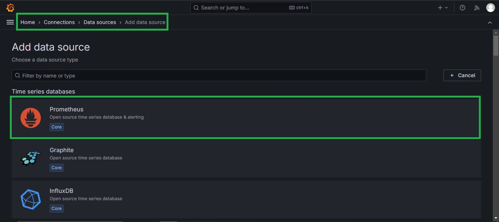
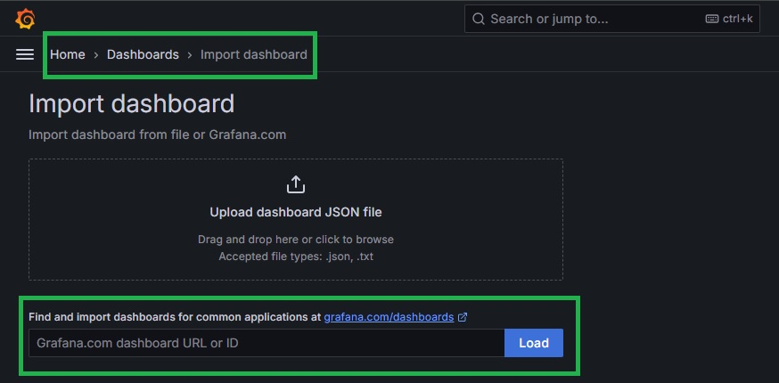
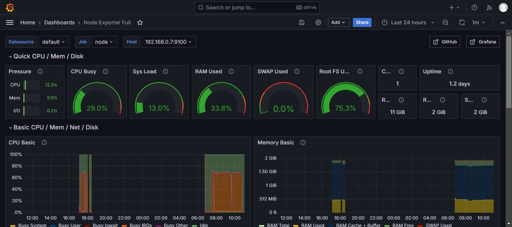

# Performance & Optimization

By monitoring container performance metrics like CPU, memory, and network usage, you can identify and troubleshoot issues before they impact users. This proactive approach helps prevent outages and ensures high application service quality.

# Requirements

1. Docker: Container management
2. Prometheus: Scrapes metrics
3. Node Exporter: Export metrics
5. Grafana: Build dashboards for monitoring

# Folder Structure

A well-defined structure promotes modularity.  Each service or component can reside in its directory, encapsulating its configuration files, Dockerfile, and related scripts.  This promotes reusability and independent development of each service.

```bash
#! bin\bash

echo "Creating Folder Structure"

mkdir -p grafana
mkdir -p prometheus
mkdir -p node-exporter
touch /prometheus/prometheus.yml
touch /grafana/docker-compose.yml
touch /prometheus/docker-compose.yml

echo "Folder Structure Created"

```

# Grafana

Grafana empowers you to turn raw data into actionable insights. By providing a centralized platform for visualization, exploration, and alerting, it helps you make data-driven decisions and optimize your systems. 


Here's how to spin up Grafana using docker-compose.

```yml
version: "3.8"
services: 
  grafana:
    image: grafana/grafana
    container_name: grafana
    restart: unless-stopped # Ensure grafana runs even if docker restarts
    ports:
     - '3000:3000'  # Allows to access UI in port 3000.
    volumes:  # Without defined volumes data will be lost when volume restarts.
      - grafana-storage:/var/lib/grafana # Mounts a local directory (grafana-storage) to
# a directory(var/lib/grafana) inside the container.
volumes:
  grafana-storage: {}

```

# Prometheus

Prometheus provides a robust and efficient solution for monitoring and alerting, making it a popular choice for organizations of all sizes. Here's how to spin up prometheus with a docker-compose file.

```yml
services:
  prometheus:
    image: prom/prometheus
    container_name: prometheus
    command: # Defines a command to be executed inside the container.
      - '--config.file=/etc/prometheus/prometheus.yml' # Tells prometheus to use the configuration file
# located at /etc/prometheus.yml
    ports:
      - 9090:9090
    restart: unless-stopped
    volumes:
      - ./prometheus:/etc/prometheus # Mounts the local directory we are to a directory inside the container.
# This allows to manage of configuration files in the container from the host.
      - prom_data:/prometheus  # Mounts a local directory to a container directory.
# This way Prometheus can save its time series data.
volumes:
  prom_data:

```

# Prometheus.YML

Prometheus.yml is the configuration file that defines the core behavior of a Prometheus server. It dictates how Prometheus collects, stores, and processes metrics. It is the blueprint for your Prometheus instance.

```yml

global:
  scrape_interval: 15s
  scrape_timeout: 10s
  evaluation_interval: 15s
alerting:
  alertmanagers:
    - static_configs:
      - targets: []
      scheme: http
      timeout: 10s
      api_version: v1
scrape_configs:
  - job_name: prometheus
    honor_timestamps: true # Instructs Prometheus to preserve the original timestamps of scraped metrics.
    scrape_interval: 15s
    scrape_timeout: 10s
    metrics_path: /metrics
    scheme: http
    static_configs:
      - targets:
        - localhost:9090
  - job_name: "node" # Scrape metrics from node-exporter 
    static_configs:
      - targets: ["192.168.0.7:9100"]
```

# Node Exporter

Node Exporter is a crucial component in the Prometheus ecosystem, primarily designed to collect and expose metrics about the underlying host machine. It's essentially a bridge between your hardware and the powerful analysis capabilities of Prometheus.

```yml
services:
  node-exporter:
    image: prom/node-exporter: latest
    container_name: node-exporter
    restart: unless-stopped
    volumes:
      - /proc:/host/proc:ro # Mounts the local /proc directory to the containers /proc
# in read-only mode. So the container could read data from the proc.
      - /sys:/host/sys:ro  
      - /:/rootfs:ro # Mounts the entire file system in read-only mode.
    command:
      - '--path.procfs=/host/proc' # Tells the container where to look for the proc directory.
      - '--path.rootfs=/rootfs'
      - '--path.sysfs=/host/sys'
      - '--collector.filesystem.mount-points-exclude=^/(sys|proc|dev|host|etc)($$|/)' # Excludes mount points from
# collection.
    ports:
      - 9100:9100
```
# Grafana: Data Sources

Once logged in to Grafana by browsing to `your-container-ip-addres:grafana-port` Prometheus can be added as a data source by navigating to `Home > Connections > Data Sorces > Add Data Source`. Then the URL where Prometheus is active must be provided. Usually `your-container-ip-address: prometheus-port`.




# Importing a Dashboard

Importing a Dashboard is arguably the fastest way to get started with Grafana. To do that navigate to `Home > Dashboards > New`. 

 

# Node Exporter Full
By providing a starting point for system monitoring, the Node Exporter Full dashboard accelerates the process of gaining valuable insights from your infrastructure.




