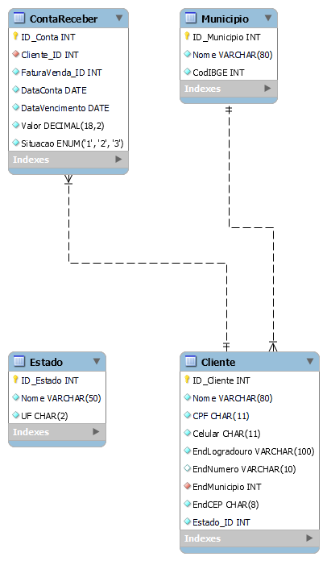
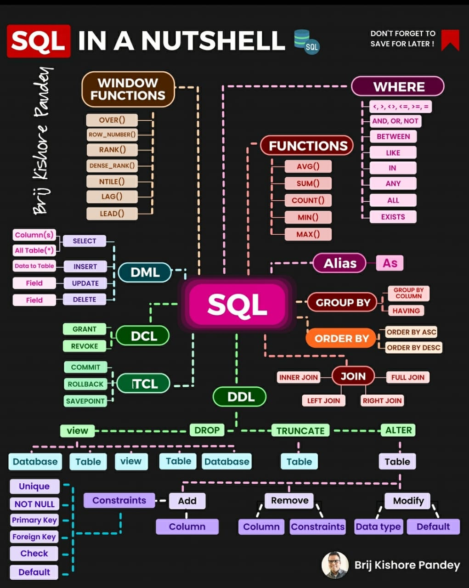

# SGBD

120 minutes

SGBD (Database Management Databases are one of the core pillars of every `system architecture`. They are essential for managing data. 

# Table of Contents

1. Prerequisites
2. Connecting to a MySQL Database Via CLI
3. Modeling And Designing A Database With MySql Workbench
4. Deploying A Database Via Script
5. Inserting Data Via Script
6. Creating A View For Easy Acces.
7. Conclusion

# Prerequisites

1. MySQL Community Server
2. MySQL Workbench

# Connecting Via CLI

The CLI(command line interface) provides a direct way to interact with the `database server`. 

```ruby
mysql -u root -p
```

# Modeling With MySql Workbench

MySQL Workbench offers a set of tools for modeling and `designing databases`. 



# SQL Categories

In SQL, there are five main categories of commands, each serving a specific purpose in managing and interacting with databases. By understanding these different categories of SQL commands, you can effectively manage your database, ensuring proper `data structure`, manipulation, `security`, and retrieval capabilities.



| DML(Data Manipulation)                                         | DDL(Data Definition Language)                                                                          |   
|--------------------------------------------------------------- |--------------------------------------------------------------------------------------------------------|
| `SELECT` column1 `FROM` table;                                 | `CREATE VIEW` view_name `AS SELECT` column1, column2, `FROM` table_name `WHERE` condition;             |     
| `INSERT INTO` table_name `VALUES` value1;                      | `CREATE DATABASE` my_database; `CREATE TABLE` employees (id INT PRIMARY KEY, name VARCHAR(100));       |
| `UPDATE` table_name `SET` column1 = value1, `WHERE` condition; | `ALTER TABLE` employees `ADD`/`MODIFY` email VARCHAR(100); `ALTER TABLE` employees `DROP COLUMN` email;|             
| `DELETE FROM` table_name `WHERE` condition;                    | `TRUNCATE` TABLE employees;                                                                            |
|                                                                | `DROP DATABASE` my_database; `DROP TABLE` employees; `DROP VIEW` employee_view;                        |
|                                                                | `ALTER TABLE` orders `ADD CONSTRAINT` fk_employee `FOREIGN KEY` (emp_id) `REFERENCES` employees(id);   |
|                                                                | `ALTER TABLE` employees `ADD CONSTRAINT` unique_name `UNIQUE` (name);                                  |                |                                                                | `ALTER TABLE` employees `ADD CONSTRAINT` check_age `CHECK` (age > 18);                                 |


# Conclusion

This repository has equipped you with a comprehensive understanding of MySQL, from its core concepts to `advanced functionalities`. You've explored data manipulation, querying, security, administration, and even how to leverage views for optimized data access. 

# Next

We will explore the SQL language in detail.

