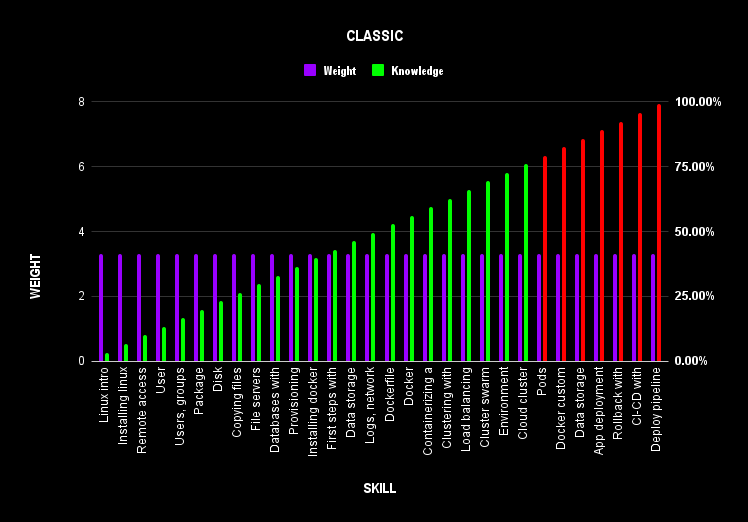
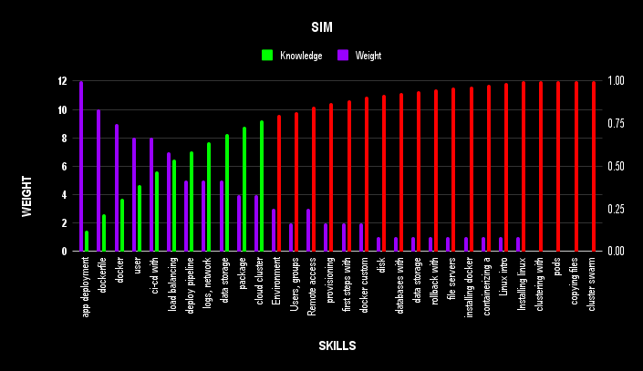

# Learning Theory

The `software engineering` landscape is constantly evolving. 

Understanding learning theory empowers one to `learn faster` and fosters continuous growth and adaptation.

# Simulation Based Training

`Simulation-based training`, as the name suggests, is a training method that creates `realistic imitations` of real-world scenarios. 

It's like practicing in a controlled environment that mimics the situations you might encounter in the field. 

Several research studies prove that simulating real-life scenarios drastically improves the quality and speed of learning. [1](https://journals.lww.com/ccmjournal/abstract/2006/01000/simulation_based_training_is_superior_to.21.aspx) 

# Classic vs SIM (Pareto's Law)

In a `classic learning environment` say school, college, professional courses, etc topics are assigned equal weight and taught in chronological order. 

In doing so the function that describes the knowledge acquired is linear. This means you can say you have learned the topic at the end of the course. The chart below explores this with the commonly required skills for DevOps Engineers. 

The red zone indicates the moment where `80% of the knowledge` is achieved

On the other hand, in a SIM (Simulation-based learning) topics are meant to imitate `real-life scenarios` weighted and ordered by relevance using Paretos Law. 

This applied to learning means that one can achieve `80% of the results` by focusing on the 20% more important skills. 

This small change changes the learning function from linear to exponential. That allows for `faster learning`. This means you can master 80% of the topic at relatively 20% of the course length. The chart below illustrates how the learning function changes by applying Pareto's law and weighting and ordering topics by relevance. 

The red zone indicates the moment where 80% of the knowledge is achieved.

The SIM also illustrates the point of `diminishing returns` (the point where your effort starts to bring less value). 

Knowing the `diminishing return` point is critical in determining when to stop investing in learning a topic; therefore, it saves us both time and effort to learn things we don't need.   

# Reuse not Redo

Reusing existing components or designs accelerates `development cycles`, as engineers can focus on new features or improvements rather than starting from scratch. Reusing resources often translates to financial savings in labor, materials, and time. 

The chart below illustrates the number of `Machine Learning` papers uploaded to Arxiv (a popular public repository of research papers).

It is noteworthy that the function describing this phenomenon exhibits exponential growth. Consequently, an increasing number of papers is correlated to an exponential increase in potential paper production. 

As the `field matures`, accumulating solutions and novel inquiries provide engineers with an `expanding resource` base for knowledge reapplication.

# Engineering vs Research

| Engineers                           |  Research                             |
|-------------------------------------|---------------------------------------|
| Problems are known                  | Problems are unknown                  |
| Execution-based                     | Research-based                        |                 
| Failure is not acceptable           | Failure is acceptable                 |
| Priority Value/Time                 | Priority  Recognition/Time            |

