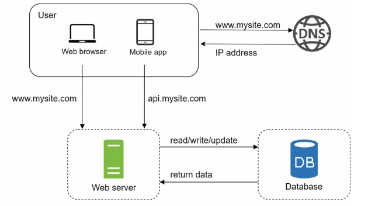

# System Design

2 hours

System design is the blueprint for a software system. It's about defining the architecture, components, modules, interfaces, and data flow to achieve specific goals.

# Single Server Set Up

A single server setup is a configuration where all system components, such as the web server, database, application server, and file storage, reside on a single physical or virtual machine.

1. The user accesses the website through a domain name(www.website.com)
2. The IP address is returned to the browser
3. Hypertext transfer protocol requests are sent to the web server.
4. The web server returns the HTML to the browser for rendering.


The script below illustrates an Apache web server deployment.

```ruby

#!/bin/bash
----------------------------------------------------------------------------------
echo "Updating and installing apache2 and unzip..."
apt-get update
apt-get upgrade -y
apt-get install apache2 -y
apt-get install unzip -y
----------------------------------------------------------------------------------
echo "Getting the website from a remote repo..."
cd /tmp
wget https://github.com/denilsonbonatti/linux-site-dio/archive/refs/heads/main.zip
----------------------------------------------------------------------------------
echo "Unziping the file and pasting into the Apache directory..."
unzip main.zip
cd linux-site-dio-main
cp -R * /var/www/html/
----------------------------------------------------------------------------------

```

# Database

With the growth of the user base, one server is not enough, and we need multiple servers: one for web/mobile traffic, and the other for the database. Separating web/mobile traffic (web tier) and database (data tier) servers allows them to be scaled independently.



Here's a MySQL database containerized deployment using docker-compose. 

```ruby
# Mysql deployment
apiVersion: apps/v1
kind: Deployment
metadata:
  name: mysql
spec:
  selector:   # Select pods with the label "mysql"
    matchLabels:
      app: mysql
  template: # a blueprint for creating pods
    metadata: # Data about the data
      labels:  # Identify pods 
        app: mysql
    spec:
      containers:
      - image: alemorales9011935/projeto-database:1.0 # Docker image used for the deployment
        args:
        - "--ignore-db-dir=lost+found"  # Ignores previous deployments
        imagePullPolicy: Always # Ensure the image is pulled even if exists locally
        name: mysql
        ports:
        - containerPort: 3306
          name: mysql
          
        volumeMounts:
        - name: mysql-dados
          mountPath: /var/lib/mysql/ # where the containers will be storaged
      volumes:
      - name: mysql-dados
        persistentVolumeClaim:
          claimName: mysql-dados
```
