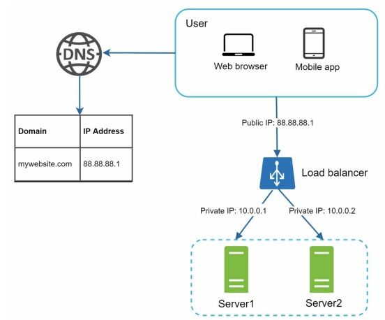
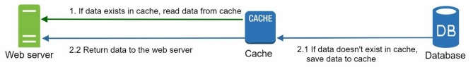
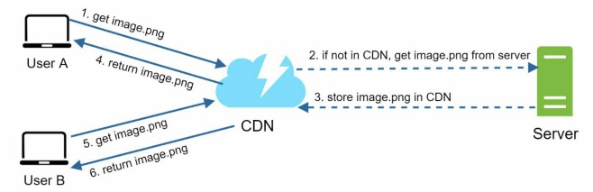
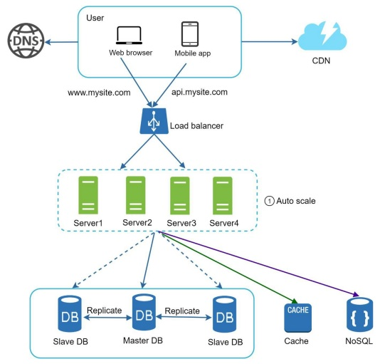
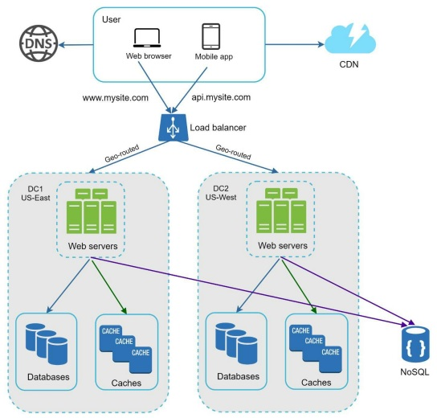
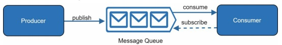
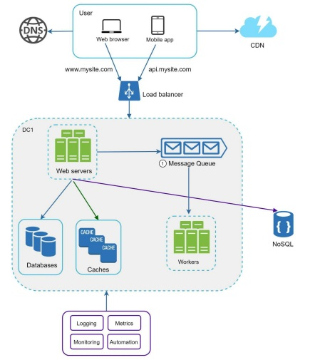

# System Design

2 hours

System design is the blueprint for a software system. It's about `defining the architecture`, components, modules, interfaces, and data flow to achieve specific goals.

<div class="warning">

Please Notice

This project is inspired by concepts from "System Design Interview" by Alex Xu. The book provided invaluable insights into system design fundamentals.

</div>

# Single Server Set Up

A single server setup is a `configuration` where all system components, such as the web server, database, application server, and file storage, reside on a single physical or virtual machine.

1. The user accesses the website through a domain name.
2. The `IP address` is returned to the browser
3. Hypertext transfer protocol requests are sent to the web server.
4. The web server returns the HTML to the browser for rendering.


The script below illustrates an Apache web server deployment.

```ruby

#!/bin/bash
----------------------------------------------------------------------------------
echo "Updating and installing apache2 and unzip..."
apt-get update
apt-get upgrade -y
apt-get install apache2 -y
apt-get install unzip -y
----------------------------------------------------------------------------------
echo "Getting the website from a remote repo..."
cd /tmp
wget https://github.com/denilsonbonatti/linux-site-dio/archive/refs/heads/main.zip
----------------------------------------------------------------------------------
echo "Unziping the file and pasting into the Apache directory..."
unzip main.zip
cd linux-site-dio-main
cp -R * /var/www/html/
----------------------------------------------------------------------------------

```

# Database

With the growth of the user base, one server is not enough, and we need multiple servers: one for web/mobile traffic, and the other for the `database`. Separating web/mobile traffic (web tier) and database (data tier) servers allows them to be scaled independently.


Here's a MySQL database containerized deployment using Kubernetes. 

```ruby
# Mysql deployment
apiVersion: apps/v1
kind: Deployment
metadata:
  name: mysql
spec:
  selector:   # Select pods with the label "mysql"
    matchLabels:
      app: mysql
  template: # a blueprint for creating pods
    metadata: # Data about the data
      labels:  # Identify pods 
        app: mysql
    spec:
      containers:
      - image: alemorales9011935/projeto-database:1.0 # Docker image used for the deployment
        args:
        - "--ignore-db-dir=lost+found"  # Ignores previous deployments
        imagePullPolicy: Always # Ensure the image is pulled even if exists locally
        name: mysql
        ports:
        - containerPort: 3306
          name: mysql
          
        volumeMounts:
        - name: mysql-dados
          mountPath: /var/lib/mysql/ # where the containers will be storaged
      volumes:
      - name: mysql-dados
        persistentVolumeClaim:
          claimName: mysql-dados
```

# Load Balancer

A `load balancer` evenly distributes incoming traffic among web servers that are defined in a load-balanced set. Users connect directly to the load balancer's public IP. 

With this setup, web servers are no longer directly unreachable by clients. 



For better security, `private IPs` are used for communication between servers. A private IP is an IP address reachable only between servers in the same network; however, it is unreachable over the Internet.

The configuration below defines a `LoadBalancer` service for a PHP application using Kubernetes. 

```ruby
apiVersion: v1 
kind: Service # Defines the type of Kubernetes object
metadata:
  name: php
spec:
  selector: # This service will find and route traffic to pods that have the label app: php. 
    app: php  # Select pods with the label "app: php"
  ports:
  - port: 80 # The port users will access from outside the cluster
    targetPort: 80 # The port php application listens 
  type: LoadBalancer # Type of Service
```

# Database Replication

Database replication can be used in many database management systems, usually with a master/slave relationship between the original (master) and the copies
(slaves). This architecture allows for failover and redundancy.


Here's a Data replication Deployment with docker-compose. 

```ruby
version: '3.7'

services:
  mysql-master:
    image: mysql:latest
    container_name: mysql-master
    environment:
      MYSQL_ROOT_PASSWORD: your_root_password
      MYSQL_DATABASE: your_database
      MYSQL_USER: your_user
      MYSQL_PASSWORD: your_password
      MYSQL_REPLICATION_MODE: master
      MYSQL_REPLICATION_USER: repl_user
      MYSQL_REPLICATION_PASSWORD: repl_password
    ports:
      - "3306:3306"
    volumes:
      - mysql-data:/var/lib/mysql

  mysql-slave:
    image: mysql:latest
    container_name: mysql-slave
    environment:
      MYSQL_ROOT_PASSWORD: your_root_password
      MYSQL_DATABASE: your_database
      MYSQL_USER: your_user
      MYSQL_PASSWORD: your_password
      MYSQL_REPLICATION_MODE: slave
      MYSQL_REPLICATION_USER: repl_user
      MYSQL_REPLICATION_PASSWORD: repl_password
      MYSQL_MASTER_HOST: mysql-master
      MYSQL_MASTER_PORT: 3306
    ports:
      - "3307:3306"
    depends_on:
      - mysql-master
    volumes:
      - mysql-data:/var/lib/mysql

volumes:
  mysql-data:

```
# Cache

A cache is a temporary storage area that stores the result of expensive responses or frequently accessed data in memory so that subsequent requests are served more quickly. 

Common Use Cases

1. Caching: Improve application performance by storing frequently accessed data in memory.
2. Session management: Store user session data for faster access.
3. Messaging: Real-time communication between applications.



Caching with Redis: Redis stands for Remote DIctionary Server. It's an open-source, in-memory data structure store that's primarily used as a cache or quick-response database. Here's a simple Redis deployment using docker-compose.

```ruby
version: '3.7'

services:
  redis:
    image: redis:latest
    container_name: redis
    ports:
      - "6379:6379"
```

# CDN (Content Delivery Network)

A CDN is a network of geographically dispersed servers used to deliver static content. CDN servers cache static content like images, videos, CSS, and JavaScript files. 



1. User A tries to get image.png by using an image URL. The CDN provider provides the URL’s domain. 
2. If the CDN server does not have image.png in the cache, the CDN server requests the
file from the origin, which can be a web server or online storage like Amazon S3.
3. The origin returns image.png to the CDN server, which includes an optional HTTP header
Time-to-Live (TTL) which describes how long the image is cached.
4. The CDN caches the image and returns it to User A. The image remains cached in the
CDN until the TTL expires.
5. User B sends a request to get the same image.
6. The image is returned from the cache as long as the TTL has not expired.

Here's a basic implementation of a CDN using Nginx:

```ruby
http {
    proxy_cache_path /var/cache/nginx/proxy_cache levels=1 keys_zone=my_cache:10m max_size=10g inactive=60m use_temp_path=off;

    server {
        listen 80;
        server_name cdn.example.com;

        location /images/ {
            proxy_pass http://origin_server;
            proxy_cache my_cache;
            proxy_cache_valid 200 1h;
            proxy_cache_use_stale error timeout invalid_header;
        }
    }
}

```
1. `proxy_cache_path:` Defines the cache directory, size, and other parameters.
2. `server block:` Configures the CDN server listening on port 80.
3. `location blocks:` Define specific paths for different content types.
4. `proxy_pass:` Specifies the origin server where the content resides.
5. `proxy_cache:` Enables caching for the specified location.
6. `proxy_cache_valid:` Sets the cache expiration time for successful responses.
7. `proxy_cache_use_stale:` Defines behavior when the cache is stale.

# Stateless vs Statesfull

A stateful server remembers client data (state) from one request to the next. A stateless server keeps no state information.



We move the session data out of the web tier and store them in the `persistent` data store. The shared data store could be a relational database, `Memcached/Redis, NoSQL`, etc. The NoSQL data store was chosen because it is easy to scale. 

`Autoscaling` means adding or removing web servers automatically based on the traffic load. After the state data is removed from web servers, `auto-scaling` of the web tier is easily achieved by adding or removing `servers` based on traffic load.

# Data Centers

To improve availability and provide a better user experience across wider geographical areas, supporting multiple data centers is crucial. In normal operation, users are `geoDNS-routed`, also known as `geo-routed`, to the closest data center, with split traffic of x% in `US-East` and (100 – x)% in US-West. `geoDNS` is a DNS service that allows domain
names to be resolved to IP addresses based on the location of a user.



# Message Queue

A message queue is a durable component, stored in memory, that supports asynchronous communication. It serves as a buffer and distributes asynchronous requests. 



Input services, called producers/publishers, create messages and publish them to a message queue. Other services or servers, called consumers/subscribers, connect to the queue and perform actions defined by the messages.

Common Use Cases:

1. `Order Processing:` Handling order placement, inventory updates, shipping notifications, etc.
2. `Data Processing:` Batching and processing large datasets.
3. `Microservices Architecture:` Enabling communication between services.
4. `Event-Driven Architectures:` Processing events and triggering actions.

# Monitoring

1. `Logging:` Monitoring error logs is important because it helps to identify errors and problems in the system. 
2. `Metrics:` Collecting different types of metrics helps us to gain business insights and understand the health status of the system.
3. `Automation:` When a system gets big and complex, we need to build or leverage automation tools to improve productivity.



# Vertical vs Horizontal Scaling

`Vertical scaling:` Switching for a more capable server(scaling up). Simple-"expensive"
`Horizontal Scaling:` Adding more servers(sharding). Complex-"cheaper"

# Conclussion

System design is the blueprint for a software system, outlining its components, architecture, and how they interact. It's the foundation upon which `software development` and `DevOps` processes are built.
